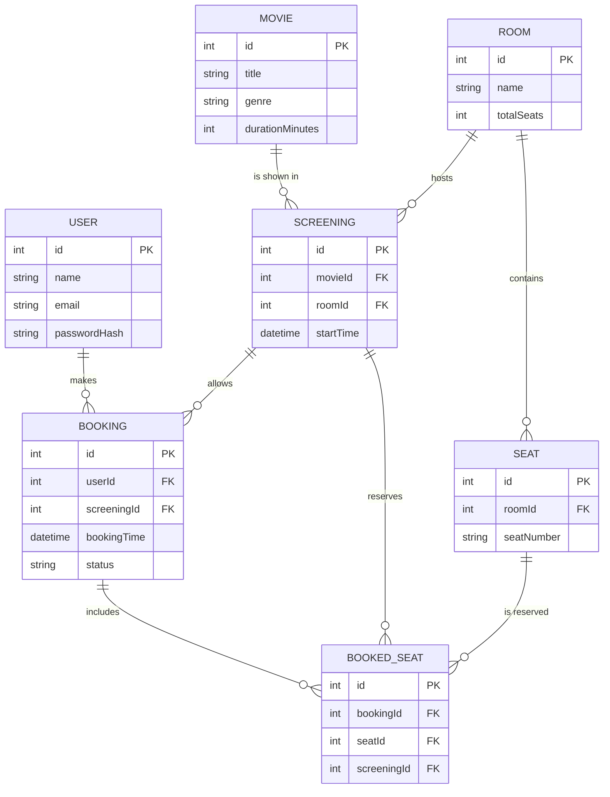
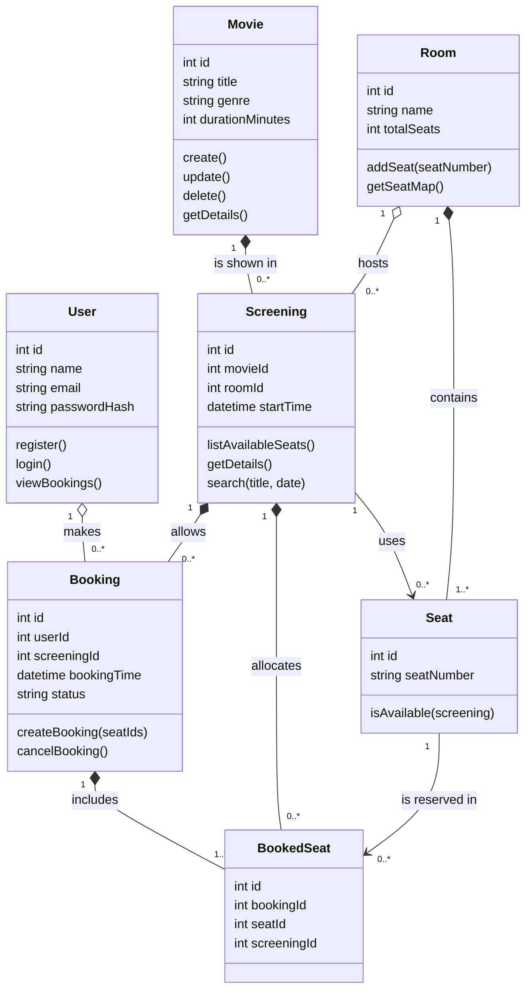
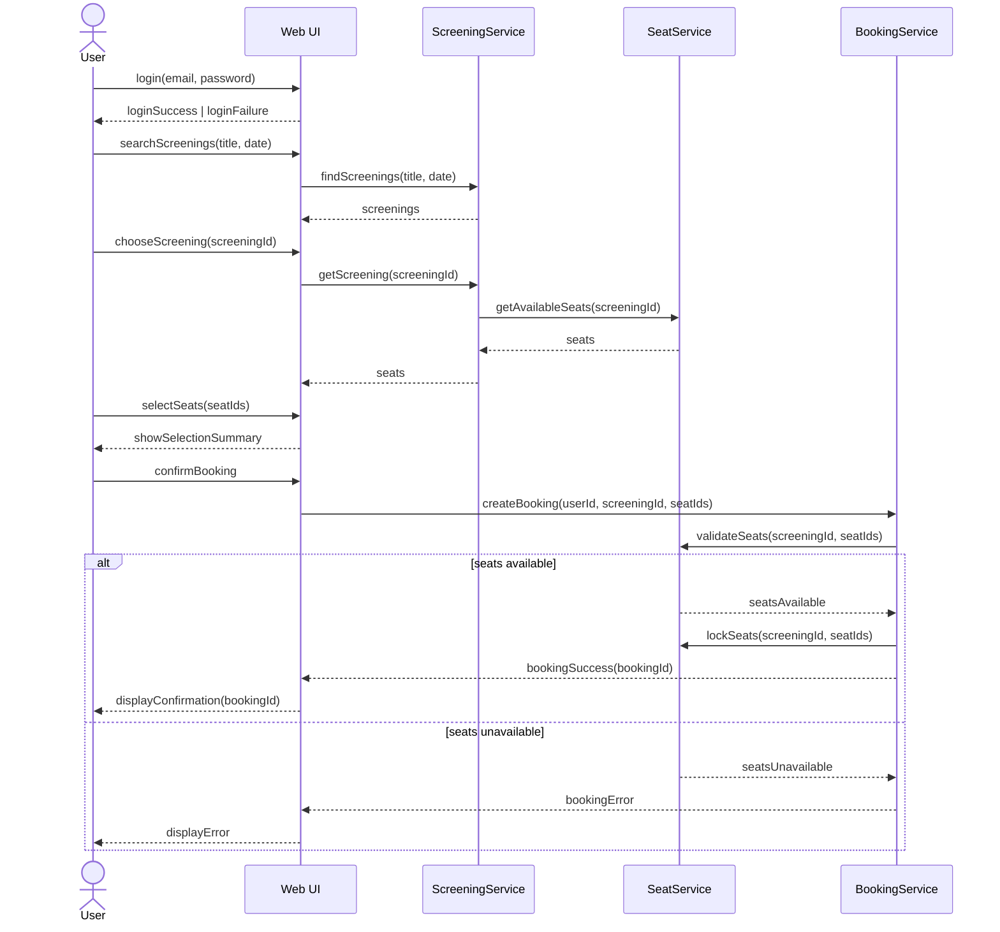
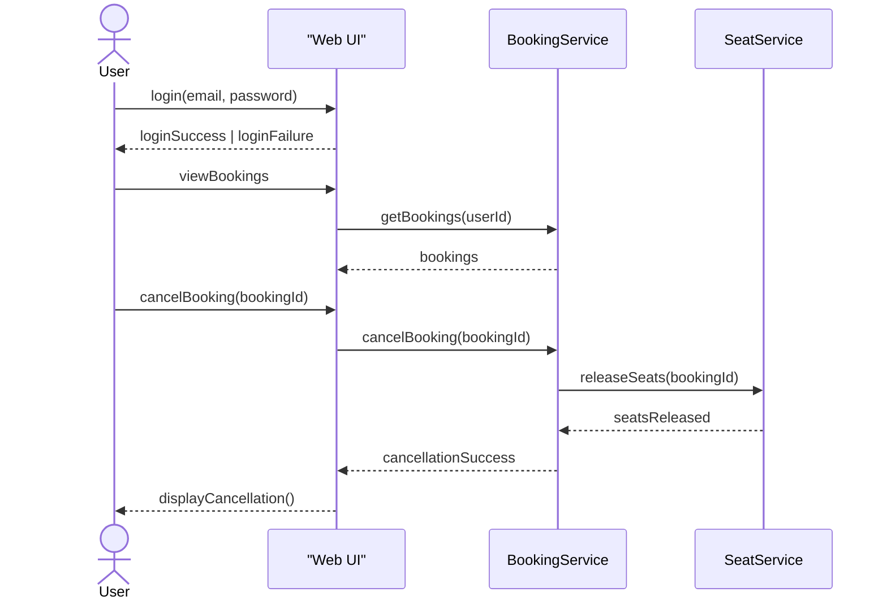
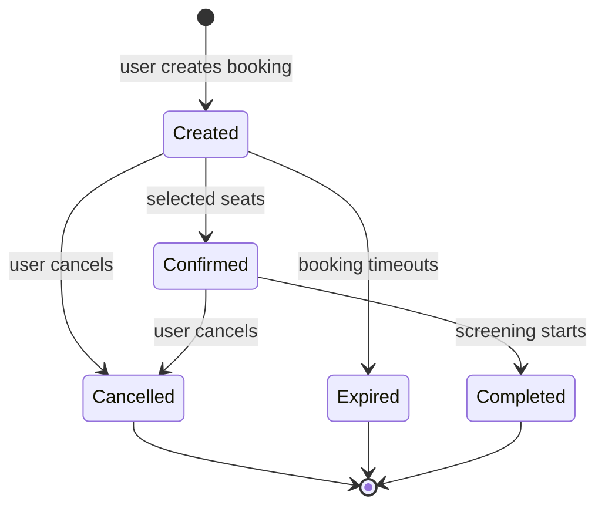
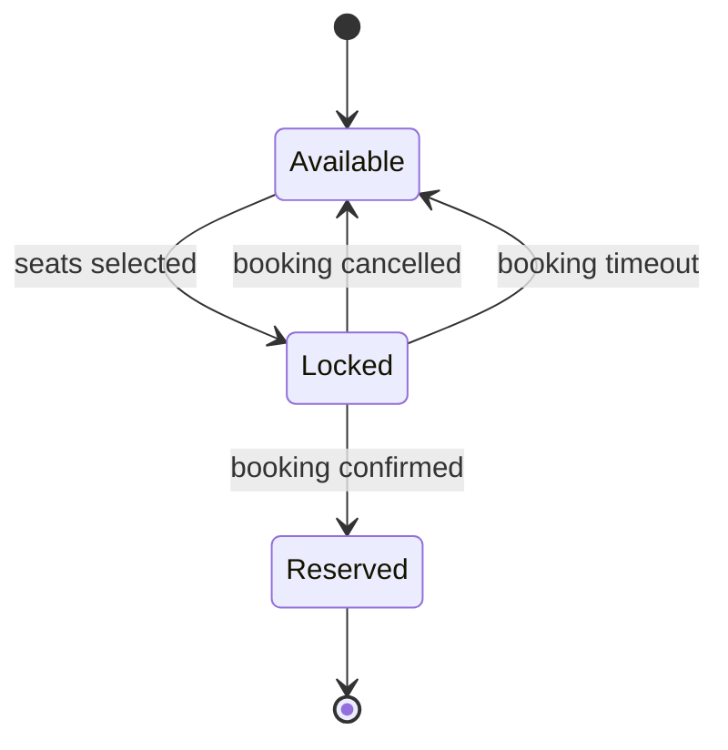

# Software Developer Design Test "Cinema Booking System"

## Entity Relationship Diagram

## Class diagram

## Sequence diagrams
### Reservation of movie screening

### Cancelation of a reservation

## State diagrams
### Booking state diagram

### Seat state diagram
